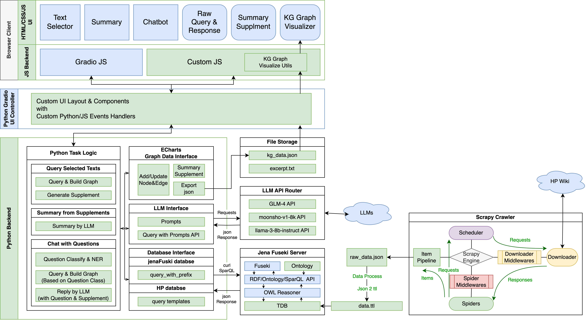

# HP-KG-Reader

我们的 HP-KG-Reader 是一个基于知识图谱的哈利波特阅读辅助工具，可以帮助用户更好地理解哈利波特小说的人物和组织关系。

我们首先通过 Scrapy 从 [哈利波特中文维基](https://harrypotter.fandom.com/zh/) 爬取了哈利波特小说中的人物和组织信息，初步清洗数据后，序列化为 ttl 格式的 rdf 文件。然后使用 Jena 和 Jena Fuseki 构建知识图谱数据库与服务器，以通过 SPARQL 查询来实现对知识图谱的查询。然后，我们使用 Gradio 库构建了一个简单的 Web 应用，用户可以通过框选文本来快速查询知识图谱中的实体关系，我们同时使用了 `Apache/Echarts.js` 来进行了知识图谱的可视化。同时，我们通过接入大语言模型(LLM)，使用户可以通过输入问题来查询知识图谱中的实体关系。

## Environment & Usage

### Clone the Repository

```bash
git clone https://github.com/YigesMx/HP-KG-Reader.git
cd HP-KG-Reader # 我们记为 PATH/TO/REPO(绝对路径) 或 .(相对路径)
```

### Python Environment

首先，我们通过 `conda` 创建一个新的 `python 3.11` 环境，并安装所需的依赖：

```bash
pip install gradio scrapy openai
```

### Data Preparation

We've already crawled the data and post-processed it into `ttl` format in `./hpkg_scrapy/harry_potter.ttl`. You can also crawl the data by yourself after preparing the python environment below by running: `scrapy crawl property` inside `./hpkg_scrapy` directory.

我们已经爬取了数据并将其后处理为 `ttl` 格式，存储在 `./hpkg_scrapy/harry_potter.ttl` 中。您也可以通过一下命令自己爬取数据并进行处理：


```bash
cd hpkg_scrapy
scrapy crawl property
python ./1-process_data.py
python ./2-json2ttl.py
cd ..
```

### Jena & Jena Fuseki Installation

首先，安装 JDK-17。然后，从 [这里](https://jena.apache.org/download/index.cgi) 下载 Jena & Jena Fuseki 服务器（在本项目发布时，版本为 5.0）。然后，将它们解压到 `./server` 目录中，目录结构如下：

```bash
HP-KG-Reader
├── assets
├── ...
├── server
│   ├── apache-jena-5.0.0
│   └── apache-jena-fuseki-5.0.0
├── ...
```

接下来，在 `~/.bashrc` 或 `~/.zshrc` 等配置中添加以下内容（注意替换 `PATH/TO/REPO` 为您的项目路径）：

```bash
export JENA_HOME=PATH/TO/REPO/server/apache-jena-5.0.0
export FUSEKI_HOME=PATH/TO/REPO/server/apache-jena-fuseki-5.0.0
export PATH=$PATH:$JENA_HOME/bin:$JENA_HOME/bat:$FUSEKI_HOME/bin
```

如果您使用的是 Windows，请在环境变量中添加 `JENA_HOME` 和 `FUSEKI_HOME`，并将 `JENA_HOME/bin` 和 `FUSEKI_HOME/bin` 添加到 `PATH` 中。

### Run Jena Fuseki Server

首先运行以下命令生成 `tdb` 数据库（注意替换 `PATH/TO/REPO` 为您的项目路径）：

```bash
tdbloader --loc="/PATH/TO/REPO/data/tdb" "PATH/TO/REPO/hpkg_scrapy/harry_potter.ttl"
```

接下来，拷贝 `./data/hp_kg_conf.ttl` 到 `./server/apache-jena-fuseki-5.0.0/run/configuration` 目录下，并修改其中的 `tdb` 数据库路径为`/PATH/TO/REPO/data/tdb`，修改 `ontology.ttl` 文件路径为 `/PATH/TO/REPO/data/ontology.ttl`。

最后，运行以下命令启动 Fuseki 服务器：

```bash 
cd ./server/apache-jena-fuseki-5.0.0
./fuseki-server
```

如果您使用的是 Windows，请在 `./server/apache-jena-fuseki-5.0.0` 目录下运行 `fuseki-server.bat`。

### Configure OpenAI API

在 `./utils/llm/config.py` 中配置您的 OpenAI API Key(可以是任何兼容 OpenAI API 的大模型 API，例如 Moonshot API)：

```python
config = {
    'url': 'http://xxx/xxx',
    'token': 'xxx',
    'model': 'xxx',
}
```

如果需要使用其它 API，例如智谱清言的 API，推荐使用 [这个仓库](https://github.com/tian-minghui/openai-style-api.git) 私有化搭建一个 API Router，将 OpenAI style 的 API 的请求转发到智谱清言的 API，这也是我们在项目中使用的方式（参考下面的项目结构图）。

### Run the Web Application

最后，在另一个终端中，在 `PATH/TO/REPO` 目录下运行以下命令：

```bash
python app.py
```

然后，您可以在浏览器中打开终端中显示的链接，即可进入 Web 应用。

## Overall Structure

以下是我们的项目的整体结构图。



几个主要的功能模块的功能与实现思路如下：

1. 爬虫与数据处理模块：
    - 初步设计知识图谱本体(`ontology.ttl`)，包括人物、学院、组织、血统等实体，以及实体之间的关系。
    - 爬虫：我们使用了 `Scrapy` 爬虫框架，通过 `xpath` 选择器来爬取了哈利波特中文维基中的人物和组织信息，存储为 `json` 格式。
    - 数据处理：我们对爬取的数据进行初步的清洗，进行基本的去重、去除冗余节点、规范修改名称后，将人物、学院、组织、血统的信息序列化为 `ttl` 格式的 `rdf` 文件，以便于后续的知识图谱构建。
    - 通过分析 `ttl` 文件，完善知识图谱的本体，包括实体的属性、关系等。
    - 使用 `Jena` 和 `Jena Fuseki` 构建知识图谱 `tdb` 数据库与服务器，以通过 `SPARQL` 查询来实现对知识图谱的查询。
2. 知识图谱数据结构与可视化模块：
    - 我们实现了一个 `EChartsGraphData` 类，用于以图数据结构的形式存储知识图谱的数据，包括实体、关系、属性等，并支持格式化导出成 `ECharts.js` 所需的 `json` 格式。
    - 我们使用了 `Apache/Echarts.js` 来进行了知识图谱的可视化，通过将知识图谱数据序列化为 `json` 格式，然后通过 `Echarts.js` 的 `graph` 类型来进行可视化。通过预定义的渲染函数，我们支持了两种布局方式：`force` 和 `circular`，并将知识图谱的实体关系以及实体属性展示在了图谱中（可以通过鼠标悬停在顶点和边上查看）。
    - 同时我们实现了一个方法，从可视化的知识图谱中总结出核心信息，作为 Supplement 以供总结模块和问答模块使用。
3. 数据库查询模块，即 `database-interface`：
    - 功能：实现了一些预定义的查询方法，包括通过名字模糊查询实体及关系、通过实体 `url` 查询实体及其属性、通过实体 `url` 查询实体关联的所有实体及其关系等。
    - 实现思路：通过设计与预定义的查询方法，设计 `SPARQL` 查询语句模版，结合数据库的 `PREFIX`，使用 `requests` 库向 `Jena Fuseki` 服务器发送 `HTTP` 请求，获取查询结果。
4. LLM 问答模块：
    - 功能：通过给出 Prompt 和构化的输入，通过接入大语言模型（任何符合 `OpenAI API` 规范的大模型 `API`），得到自然的回答。
    - 实现思路：通过 `openai` 库，将输入的问题和 Prompt 传递给大语言模型，获取回答。
5. 选词查询模块：
    - 功能：用户可以通过框选文本（网页中任何可框选文本皆可，包括右侧的总结结果和问答内容），并按下 `shift+s` 来查询知识图谱中的包含选中文本的实体。通过框选另一些词，并按下 `shift+a` 来添加需要查询的实体。同时也可以手动在“Selected Texts”输入框中输入相应格式的文本来进行实体查询。相应结果和所用到的查询会显示在可视化模块以及下方的查询结果框中。
    - 实现思路：通过 `Javascript` 捕获选中文本的事件，将选中文本传递给后端，后端分词后，通过设计的 `database-interface` 查询方法，查询知识图谱中的实体及其关系，返回结果。
6. 总结模块：
    - 功能：通过知识图谱数据结构模块生成的 Supplement，我们通过设计一个总结 Prompt，通过大语言模型，生成一个总结，将核心信息以自然语言的形式展示给用户。
7. 问答模块：
    - 功能：用户可以通过输入问题，查询知识图谱中相关的实体及关系，并得到自然语言的回答。
    - 实现思路：首先通过一个 Classification & NER Prompt，通过大模型将问题分类并识别实体。然后通过设计的查询方法，查询知识图谱中的实体及其关系。将查询得到的实体及关系使用知识图谱数据结构及可视化模块进行可视化和 Supplement 生成。最后通过设计的问答 Prompt，将问题和 Supplement 作为输入，通过大模型得到自然语言的回答。